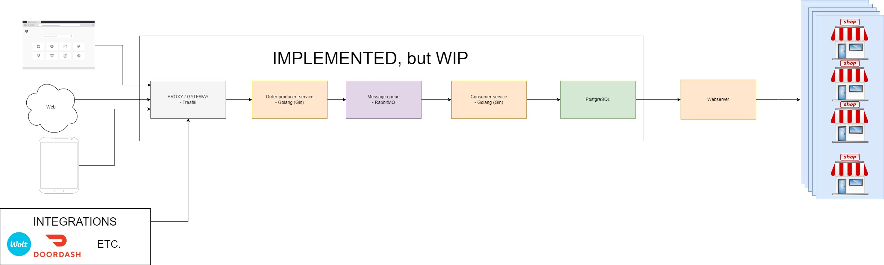

# Go-Sandwich: A Sandwich Chain Backend Demo
    A backend practice project for an imaginary sandwich chain, demonstrating an asynchronous, message-driven order processing system.

This project simulates the backend for an imaginary subway-style sandwich store. It's designed to handle customer orders efficiently by processing them asynchronously. When an order is submitted to the API, it is placed onto a RabbitMQ message queue, processed by a separate consumer service, and finally stored in a PostgreSQL database.

The demo is still work-in-progress

# Architecture
The system follows a decoupled, asynchronous architecture to ensure that the API can handle high volumes of incoming orders without being blocked by database operations.


There is also an architecture pic in **docs/architecture.drawio**

# Requirements
Before you begin, ensure you have the following installed:
- Git: To clone the repository.
- Docker: Version 20.10 or newer.
- Docker Compose: Version v2.0 or newer.

## Nice to have
- Task, just because of the utility scripts in Taskfile.yml
    - https://taskfile.dev/
- VSCode
    - https://code.visualstudio.com/
- Go, at least version go1.24.5 windows/amd64
    - Local development, can be run without it

# 🚀 Getting Started
## 1. Clone the repository
```
git clone https://github.com/SAVE-1/Go-Sandwich.git
cd [repository-folder]
```

## 2. Run the application:
The easiest way to start all services is using Task:
```
task up
```

Alternatively, using Docker Compose directly:
```
# This will build the containers and run them in the background.
docker compose -f ./infra/compose-dev.yaml up -d
```

## 3. Place a new order:
Once the containers are running, you can post a new sandwich order to the API endpoint. Open a new terminal and use a tool like curl:
```
curl -X POST "http://localhost:80/sandwich" \
  -H "Content-Type: application/json" \
  -H "Accept-Language: en-US,en;q=0.5" \
  -d '{
    "count": 2,
    "name": "Test sandwich",
    "type": 0
  }'
```

# Future Plans (Roadmap)
This is a work-in-progress project. Future enhancements include:
- Implement backend logic for assigning orders to specific store locations.
- Add an API endpoint to check the status of an existing order.
- Develop a simple UI for placing orders.

# License
This project is licensed under the MIT License.
